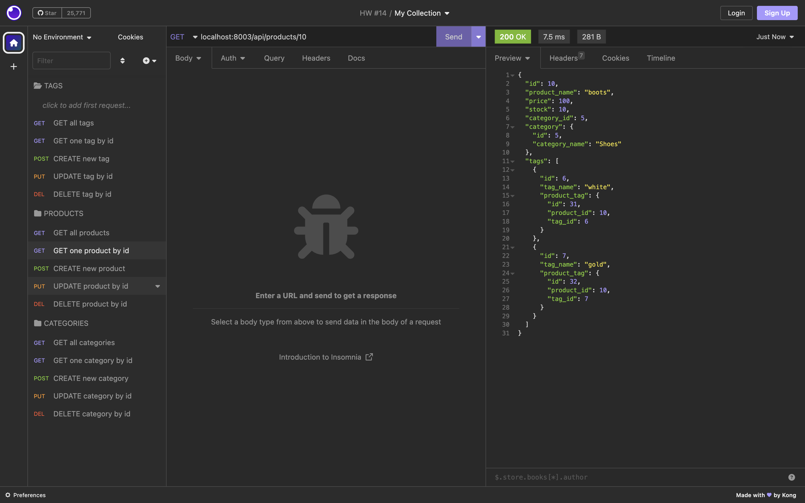

# Object-Relational-Mapping-ORM-Challenge-E-commerce-Back-End
HW Challenge #13


## Description
Our challenge for this assignment was build the back end for an e-commerce site. We’ll take a working Express.js API and configure it to use Sequelize to interact with a MySQL database. This assignment was quite challenging. Although also very helpful for future work. It was extremely helpful being provided starter code. 

## Table of Contents
* [Installation](#installation)
* [Getting Started](#Getting-Started)
* [User Story](#User-Story)
* [Acceptance Criteria](#Acceptance-Criteria)
* [Usage](#Usage)
* [Demo](#Demo)
* [Technologies Used](#Technologies-Used)
* [Support](#Support)
* [Credits](#Credits)
* [Contributors](#Contributors)


## Installation
The steps to installation are shown below:

- First, clone the repo
- Install all dependencies `npm install`
- Set up the environment variables
    * create an .env folder
    * make sure to have the information listed below
        * DB_NAME = 'ecommerce_db'
        * DB_USER = ''
        * DB_PASSWORD = ''
- Create database
    * `mysql -u root -p`
    * my sql > `.db/schema.sql`
    * my sql > `quit`
- Seed the database (this is optional)
    * `npm run seed`
- Run the application
    *  `npm start`
## Getting Started

You'll need to use the [MySQL2package](https://www.npmjs.com/package/mysql2) and [Sequalize](https://www.npmjs.com/package/sequelize) packages to connect your Express.js API to a MySQL database and the [dotenv](https://www.npmjs.com/package/dotenv) to use environment variables to store sensitive data, like your MySQL username, password, and database name. Use the ```schema.sql``` file in the ```db``` folder to create your database using MySQL shell commands. Use environment variables to store sensitive data, like your MySQL username, password, and database name.

- Database Models
Your database should contain the following four models, including the requirements listed for each model:

    * ```Category```

        * ```id```

        * Integer

        * Doesn't allow null values

        * Set as primary key

        * Uses auto increment

        * ```category_name```

        * String

       * Doesn't allow null values

    * ```Product```

        * ```id```

        * Integer

        * Doesn't allow null values

        * Set as primary key

        * Uses auto increment

        * ```product_name```

        * String

        * Doesn't allow null values

        * ```price```

        * Decimal

        * Doesn't allow null values

        * Validates that the value is a decimal

        * ```stock```

        * Integer

        * Doesn't allow null values

        * Set a default value of 10

        * Validates that the value is numeric

        * ```category_id```

        * Integer

        * References the ```category``` model's ```id```

    * ```Tag```

        * ```id```

        * Integer

        * Doesn't allow null values

        * Set as primary key

        * Uses auto increment

        * ```tag_name```

        * String

    * ```ProductTag```

        * ```id```

        * Integer

        * Doesn't allow null values

        * Set as primary key

        * Uses auto increment

        * ```product_id```

        * Integer

        * References the ```product``` model's ```id```

        * ```tag_id```

        * Integer

        * References the ```tag``` model's ```id```

    * Associations
    You'll need to execute association methods on your Sequelize models to create the following relationships between them:

        * ```Product``` belongs to ```Category```, as a category can have multiple products but a product can only belong to one category.

        * ```Category``` has many ```Product``` models.

        * ```Product``` belongs to many ```Tag``` models. Using the ProductTag through model, allow products to have multiple tags and tags to have many products.

        * ```Tag``` belongs to many ```Product``` models.

        * Hint
        Make sure you set up foreign key relationships that match the column we created in the respective models.


    * Fill Out the API Routes to Perform RESTful CRUD Operations
    Fill out the unfinished routes in ```product-routes.js```, ```tag-routes.js```, and ```category-routes.js``` to perform create, read, update, and delete operations using your Sequelize models.


        * Note
        The functionality for creating the many-to-many relationship for products is already done for you.

        * Hint
        Be sure to look at your module project's code for syntax help and use your model's column definitions to figure out what ```req.body``` will be for POST and PUT routes!

    * Seed the Database
    After creating the models and routes, run ```npm run seed``` to seed data to your database so that you can test your routes.

    * Sync Sequelize to the Database on Server Start
    Create the code needed in ```server.js``` to sync the Sequelize models to the MySQL database on server start.


## User Story
- AS A manager at an internet retail company
- I WANT a back end for my e-commerce website that uses the latest technologies
- SO THAT my company can compete with other e-commerce companies

## Acceptance Criteria
- GIVEN a functional Express.js API
- WHEN I add my database name, MySQL username, and MySQL password to an environment variable file
- THEN I am able to connect to a database using Sequelize
- WHEN I enter schema and seed commands
- THEN a development database is created and is seeded with test data
- WHEN I enter the command to invoke the application
- THEN my server is started and the Sequelize models are synced to the MySQL database
- WHEN I open API GET routes in Insomnia Core for categories, products, or tags
- THEN the data for each of these routes is displayed in a formatted JSON
- WHEN I test API POST, PUT, and DELETE routes in Insomnia Core
- THEN I am able to successfully create, update, and delete data in my database

## Usage
- While the server is still running, it is ready for any REST client to make the API calls.
- Even though the front end was in included in this challenge assignment, the APIs can be called by using a REST client of your choice (for example Postman or Insomnia). 
    * TAGS
        * GET all tags
            *  http://localhost:8003/api/tags
        * GET one tag by id
            * GET http://localhost:8003/api/tags/:id
        * CREATE new tag
            * POST http://localhost:8003/api/tags
            * The JSON body request should look like below: 
            `````
            {
	          "tag_name": "purple"
            }
            `````
        * UPDATE tag by id
            * PUT http://localhost:8003/api/tags/:id
            * The JSON body request should look like below: 
            `````
            {
	         "tag_name": "light purple"
            }
            `````
        * DELETE tag by id
            * DELETE http://localhost:8003/api/tags/:id
    * PRODUCTS
        * GET all products
            * GET http://localhost:8003/api/products
        * GET one product by id
            * GET http://localhost:8003/api/products/:id
        * CREATE new product
            * POST http://localhost:8003/api/products
            * The JSON body request should look like below: 
            `````
            {
	         "product_name": "boots",
	         "price": 100.00,
	         "stock": 10,
	         "category_id": 5,
	         "tagIds": [6,7]
            }
            `````
        * UPDATE product by id
            * PUT http://localhost:8003/api/products/:id
            * The JSON body request should look like below: 
            `````
            {
	         "product_name": "steel toed boots",
	         "price": 150.00,
	         "stock": 20,
	         "category_id": 5,
	         "tagIds": [6,7]
            }
            `````
        * DELETE products by id
            * DELETE http://localhost:8003/api/products/:id
    * CATEGORIES
        * GET all categories
            * GET http://localhost:8003/api/categories
        * GET one category by id
            * GET http://localhost:8003/api/categories/:id
        * CREATE new category
            * POST http://localhost:8003/api/categories
            * The JSON body request should look like below: 
            `````
            {
	         "category_name": "sweater"
            }
            `````
        * UPDATE category by id
            * PUT http://localhost:8003/api/categories/:id
            * The JSON body request should look like below: 
            `````
            {
	         "category_name": "sweater vest"
            }
            `````
        * DELETE category by id
            * DELETE http://localhost:8003/api/categories/:id
    

## Demo

Walkthrough Video

Please [click here](https://youtu.be/Du7ppQs5wes) for a walkthrough video that demonstrates the application's functionality.


Screenshots
- TAGS 

* GET all tags 


* GET one tag by id


* CREATE new tag


* CREATE one tag by id after creating new tag


* UPDATE tag by id


* GET one tag by id after updating new tag 


* DELETE tag by id


- PRODUCTS

* GET all products


* GET one product by id


* CREATE new product


* CREATE one product by id after creating new product


* UPDATE product by id


* GET one product by id after updating new product


* DELETE product by id


- CATEGORIES 

* GET all categories
    

* GET one cateogry by id
    

* CREATE new category


* CREATE one category by id after creating new category


* UPDATE category by id


* GET one category by id after updating new category


* DELETE category by id


## Technologies Used


## Support
If you need support or have any questions about the repo, please [open an issue](https://github.com/hannybear88/Node.js-Challenge-Professional-README-Generator/issues) or contact me via email at hannahkchung88@gmail.com. You can find more of my work on my GitHub, [hannybear88](https://github.com/hannybear88/).

## Credits
- Starter code provided by UCSD
- Code by Hannah Chung

## Contributors
- Starter code provided by UCSD
- Code by Hannah Chung